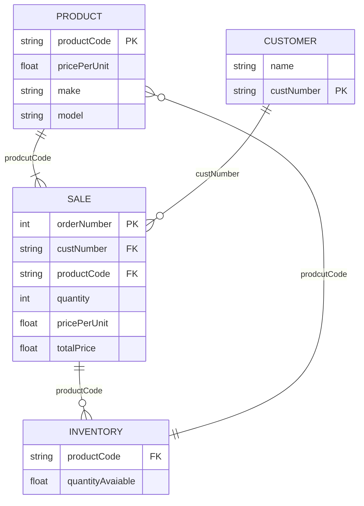

Product table is related to the sale and inventory tables by the productcode. This allows the aggregation of the total sale by the quantity and price of the product. The inventory can be updated by subtracting the quantity sold from the quantityavailable. The customer table is related to the sale by customernumber to track purchased products by the customer
